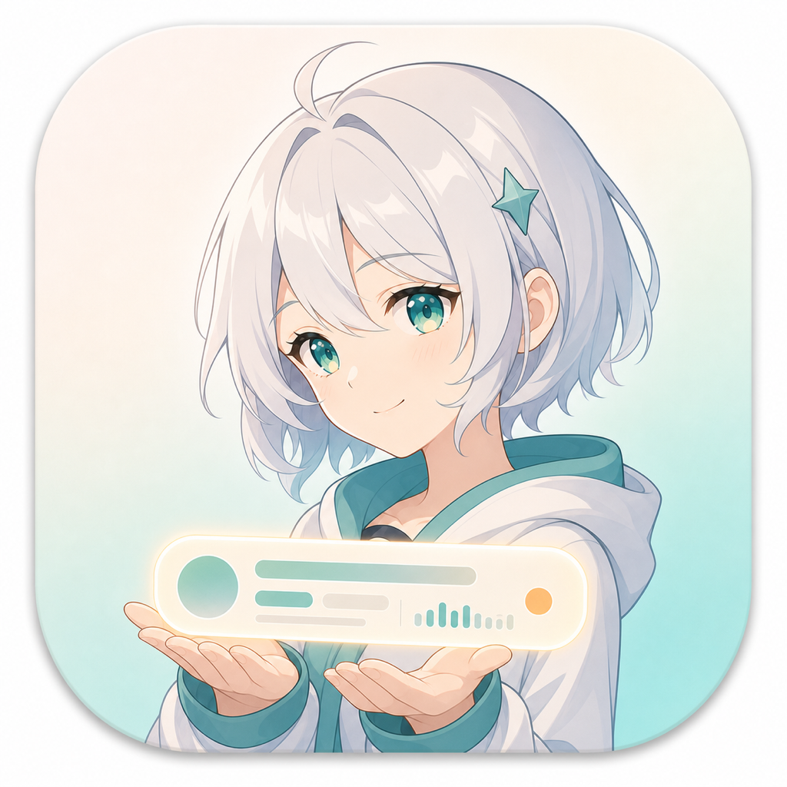

# Statusa

<p align="center">
  
</p>

> A tiny status muse for your macOS menu bar. Statusa turns "what am I doing right now?" into a cute little status you can keep, map, and publish.

[](https://www.apple.com/macos/)
[](https://swift.org/)
[](https://developer.apple.com/xcode/)
[](LICENSE)

[中文文档](README.zh-CN.md)

Statusa watches your focused app, window title, foreground time, and now-playing media. Keep her local as a tiny activity diary, or let her carry your current status to a personal site, bot, stream overlay, profile badge, or webhook.

Examples:

- `Browsing with Chrome`
- `Playing Baldur's Gate 3, BGM: Song Title - Artist`
- `Writing code in Xcode for 1.25 hours`
- `Watching videos, probably "research"`

## Why

Most presence tools only know whether you are online. Statusa can say what kind of online you are: surfing the web, coding, gaming, watching a show, listening to music, or anything else you map it to. She stays quiet in the menu bar, then lifts one neat little "current status" card when you ask.

Good uses:

- Show your current surfing, gaming, coding, or music status on a personal site.
- Send activity updates to a chat bot, dashboard, or webhook.
- Keep a local timeline of focused apps and media playback.
- Rename noisy app/window data into friendly public labels.
- Filter sensitive apps before anything is stored or sent.

## Features

- Menu bar app, lightweight, quiet, and just a little charming.
- Tracks focused app, window title, and app foreground duration.
- Reads system now-playing metadata locally.
- Stores history with SwiftData.
- Sends reports through configurable shell commands.
- Supports filters and mapping rules for privacy-friendly public status.

## Requirements

- macOS 15.0 or later.
- Accessibility permission if you want window titles.
- Xcode 15 or later for development.

Media tracking uses Apple's private `MediaRemote.framework`, so this is local tooling, not an App Store-safe media API story.

## Install

1. Download the latest release.
2. Open the `.dmg`.
3. Drag Statusa into Applications.
4. Launch it.
5. Grant Accessibility permission when macOS asks.

On first launch, Preferences opens so you can choose what to track.

Releases are ad-hoc signed and not Apple-notarized, so macOS may say Apple cannot verify the app. First launch options:

- Right-click Statusa in Applications and choose Open.
- Or run:

```sh
xattr -dr com.apple.quarantine /Applications/Statusa.app
```

## Configure

- General: enable reporting, set interval, choose app/media data.
- Filters: exclude private apps before saving or sending.
- Mapping: turn raw app names or bundle IDs into friendly descriptions.
- Integrations: run shell commands with the latest report.

Mapping is where the app becomes fun. Turn `Google Chrome` into `surfing the web`, `Steam` into `gaming`, or `Xcode` into `building something questionable`.

## Shell

Shell is the only external integration. It is boring on purpose: you own the command, the destination, and the risk.

Open Preferences -> Integrations, enable Shell, enter a command, then use Test to inspect exit code, stdout, and stderr.

Webhook example:

```sh
curl -X POST "https://example.com/report" \
  -H "Content-Type: application/json" \
  -d "$PROCESS_REPORTER_JSON"
```

Local log example:

```sh
mkdir -p /tmp/process-reporter
printf '%s\n' "$PROCESS_REPORTER_JSON" >> /tmp/process-reporter/reports.jsonl
```

Human-readable status example:

```sh
message="${PROCESS_REPORTER_PROCESS_DESCRIPTION:-Using ${PROCESS_REPORTER_PROCESS_NAME:-Unknown app}}"

if [[ -n "$PROCESS_REPORTER_MEDIA_NAME" ]]; then
  message="$message, BGM: $PROCESS_REPORTER_MEDIA_NAME"
  if [[ -n "$PROCESS_REPORTER_MEDIA_ARTIST" ]]; then
    message="$message - $PROCESS_REPORTER_MEDIA_ARTIST"
  fi
fi

if [[ -n "$PROCESS_REPORTER_PROCESS_USAGE_DURATION" ]]; then
  hours="$(awk "BEGIN { printf \"%.2f\", $PROCESS_REPORTER_PROCESS_USAGE_DURATION / 3600 }")"
  message="$message for $hours hours"
fi

printf '%s\n' "$message"
```

Commands run through `/bin/zsh -lc` with your user permissions. Only run commands you understand.

## Environment

Every shell report gets these variables. Missing values are empty strings.

- `PROCESS_REPORTER_JSON`
- `PROCESS_REPORTER_EVENT` (`report`, `screen_sleep`, or `screen_wake`)
- `PROCESS_REPORTER_SCREEN_STATE` (`off`, `on`, or empty for a regular report)
- `PROCESS_REPORTER_PROCESS_NAME`
- `PROCESS_REPORTER_PROCESS_DESCRIPTION`
- `PROCESS_REPORTER_PROCESS_USAGE_DURATION`
- `PROCESS_REPORTER_WINDOW_TITLE`
- `PROCESS_REPORTER_PROCESS_BUNDLE_ID`
- `PROCESS_REPORTER_MEDIA_NAME`
- `PROCESS_REPORTER_MEDIA_ARTIST`
- `PROCESS_REPORTER_MEDIA_ALBUM`
- `PROCESS_REPORTER_MEDIA_PROCESS_NAME`
- `PROCESS_REPORTER_MEDIA_PROCESS_DESCRIPTION`
- `PROCESS_REPORTER_MEDIA_PROCESS_BUNDLE_ID`
- `PROCESS_REPORTER_MEDIA_DURATION`
- `PROCESS_REPORTER_MEDIA_ELAPSED_TIME`
- `PROCESS_REPORTER_MEDIA_PLAYING`
- `PROCESS_REPORTER_TIMESTAMP`

`PROCESS_REPORTER_JSON` contains the same report as structured JSON, including the event type, screen state, process, media, and foreground usage data. Screen sleep and wake events run the selected Shell command even when there is no process or media payload.

The environment variable prefix stays `PROCESS_REPORTER_*` for compatibility with existing scripts. Statusa got a new name, but your webhook should not have to wake up confused.

## Privacy

Statusa does not take screenshots, record keystrokes, read file contents, or track mouse paths. She records app names, window titles, media metadata, and timing according to your settings.

Start private:

- Keep Shell disabled until local history looks right.
- Filter password managers, banking apps, private browsers, and sensitive work tools.
- Map raw names into vague public labels when publishing status.
- Keep webhook URLs secret.

## Vibe Coding Mode

Enable **Vibe Coding Mode** from the menu bar when a build, agent, download, or other long-running task should continue unattended. Statusa keeps macOS awake while still allowing the display to sleep according to the normal system settings.

After enabling it, choose **Turn Display Off Now** to sleep the display immediately. Mouse or keyboard input wakes the display again while the background task keeps running.

The mode needs no administrator permission, starts no separate `caffeinate` process, releases its power assertions when disabled or when Statusa quits, and does not prevent a MacBook from sleeping when its lid is closed.

The IOKit assertion approach is adapted from the MIT-licensed `demiaochen/caffeinate-disablesleep` project. Statusa intentionally uses only the system-awake/display-may-sleep behavior; it does not change `pmset disablesleep` or install sudoers rules.

See `THIRD_PARTY_NOTICES.md` for the full third-party license notice.

## Troubleshooting

- Missing window titles: enable System Settings -> Privacy & Security -> Accessibility for Statusa, then restart it.
- Shell command fails: use Test, check stdout/stderr, prefer absolute paths.
- Menu bar icon missing: confirm the app is running in Activity Monitor, then restart it.
- High memory usage: clear old history and reduce report frequency.

## Development

```sh
open ProcessReporter.xcodeproj
xcodebuild -project ProcessReporter.xcodeproj -scheme ProcessReporter -configuration Debug build
```

No third-party Swift packages are required. New external reporting should usually go through `ShellReporterExtension`, not a new built-in service SDK.

Useful entry points:

- `ProcessReporter/App/ProcessReporterApp.swift`
- `ProcessReporter/Features/Reporting/Reporter.swift`
- `ProcessReporter/Features/Reporting/Reporter+Shell.swift`
- `ProcessReporter/Features/Settings/PreferencesStore.swift`
- `ProcessReporter/Features/Media/MediaInfoManager.swift`
- `ProcessReporter/Features/History/DataStore.swift`

## License

2026 © Shadowsight9, released under the MIT License.

Forked from Innei's ProcessReporter. Original work © Innei, also released under the MIT License.

## Beginner development path

If you are learning macOS and Swift with this project, start with the Chinese walkthrough in [`docs/LEARNING_GUIDE.zh-CN.md`](docs/LEARNING_GUIDE.zh-CN.md). It explains the data flow, reading order, concurrency boundaries, and small practice tasks.

Run the complete local verification loop with:

```sh
scripts/check.sh
```

The Release Workflow injects the app version from the Git tag. For example, `v1.6.0` becomes `CFBundleShortVersionString = 1.6.0`, while the commit count becomes the build number. Prerelease tags such as `v1.6.0-beta.1` are also supported.
